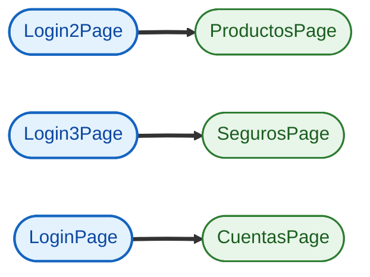

# Grafo de Page Objects

> Generado: 2026-04-30T02:15:18.328Z
> **6** pages · **3** conexiones

**Leyenda:** 🟦 inicio · 🟪 intermedia · 🟩 terminal

```mermaid
flowchart LR
    classDef inicio fill:#E3F2FD,stroke:#1565C0,stroke-width:2px,color:#0D47A1;
    classDef intermedia fill:#F3E5F5,stroke:#6A1B9A,stroke-width:1.5px,color:#4A148C;
    classDef terminal fill:#E8F5E9,stroke:#2E7D32,stroke-width:1.5px,color:#1B5E20;

    CuentasPage([CuentasPage]):::terminal
    Login2Page([Login2Page]):::inicio
    Login3Page([Login3Page]):::inicio
    LoginPage([LoginPage]):::inicio
    ProductosPage([ProductosPage]):::terminal
    SegurosPage([SegurosPage]):::terminal

    Login2Page ==> ProductosPage
    Login3Page ==> SegurosPage
    LoginPage ==> CuentasPage
```
