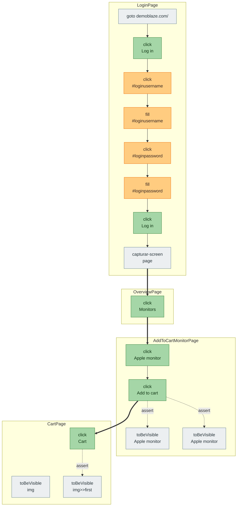

# Grafo de Nodos

> Generado: 2026-05-13T15:54:23.247Z
> **16** nodos · **8** intra-page · **3** inter-page · **3** asserts

**Confiabilidad del locator:**
🟩 5 = id/testid · 🟢 4 = role+name · 🟡 3 = label · 🟧 2 = placeholder/text · 🟥 1 = CSS/posicional · ⬜ N/A (goto, assert) · 🟪 capturar · 🟦 verificar

**Aristas:** finas `-->` intra-page · gruesas `==>` inter-page (`conecta`) · punteadas `-.assert.->` desde el último nodo de la page hacia cada assert.

