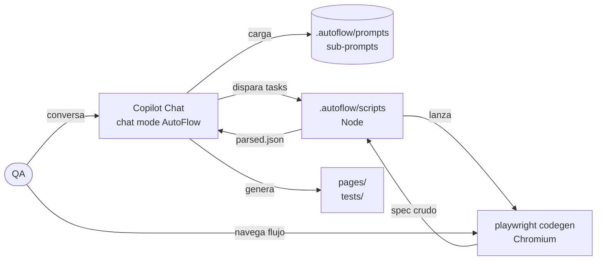
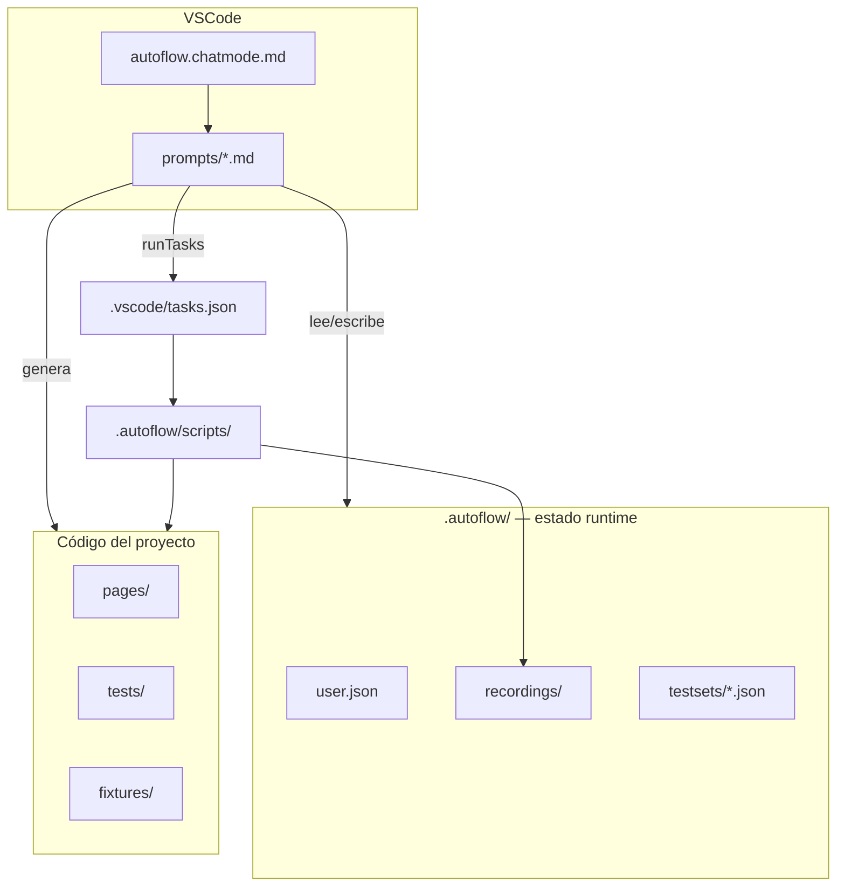
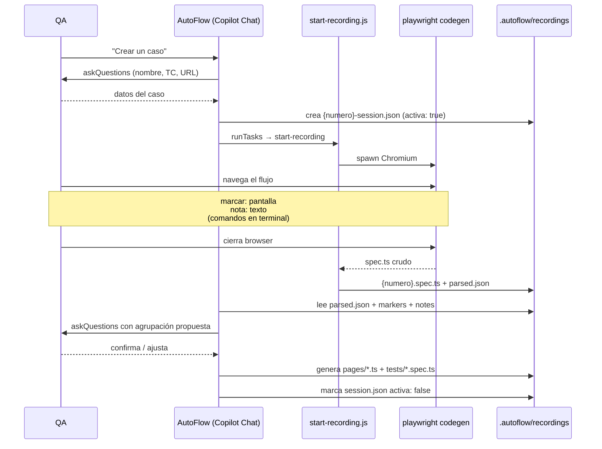

# AutoFlow

Compañero de automatización para QAs. Combina un **chat mode de GitHub Copilot Chat** con scripts de Node que orquestan `playwright codegen` para grabar sesiones manuales y generar **Page Objects + tests en TypeScript** sin que el QA escriba código.

> Solo homologación. No usar contra producción.

## Qué es AutoFlow

Es un agente conversacional que vive dentro de VS Code. El QA navega su flujo en el browser; AutoFlow captura la grabación, la parsea, propone un agrupamiento en pantallas, y genera los Page Objects y el spec de Playwright siguiendo las convenciones del repo.



## Cómo funciona por dentro

El cerebro está en tres lugares:

| Pieza | Ubicación | Rol |
| --- | --- | --- |
| **Chat mode** | `.github/chatmodes/autoflow.chatmode.md` | Personalidad, reglas de arranque y routing entre sub-prompts. |
| **Sub-prompts** | `.autoflow/prompts/*.md` | Un archivo por acción (crear caso, correr set, generar POM, etc.). El agente los carga on-demand. |
| **Scripts Node** | `.autoflow/scripts/*.js` | Disparan codegen, parsean su output, corren tests y test sets. |

El agente solo **conversa, lee/escribe archivos y dispara VSCode tasks**. Toda la lógica imperativa (lanzar codegen, parsear el `.spec.ts` crudo, ejecutar Playwright) vive en los scripts de Node.



## Flujo típico: crear un caso



Durante la grabación el chat queda **bloqueado** esperando que el QA cierre Chromium. Los comandos `marcar:`, `nota:`, `terminé`, `cancelar` se tipean en la terminal — no en el chat — porque el QA está concentrado en el flujo y abrir un panel lo distraería.

## Las 6 acciones del menú

| Acción | Sub-prompt | Qué hace |
| --- | --- | --- |
| ✨ Crear un caso | `crear-caso.md` | Lanza codegen, captura marcadores, genera POMs y spec. |
| ✏️ Editar un caso | `editar-caso.md` | Regrabar, editar código a mano o appendear pasos. |
| ▶️ Correr un caso | `correr-caso.md` | Ejecuta un spec puntual con UI mode. |
| 📦 Crear test set | `crear-test-set.md` | Agrupa varios casos en un JSON dentro de `testsets/`. |
| 🔧 Editar test set | `editar-test-set.md` | Modifica un set existente. |
| 🚀 Correr test set | `correr-test-set.md` | Corre toda la regresión del set. |

## Cómo conversa el agente

AutoFlow usa la herramienta nativa **`vscode/askQuestions`** de Copilot Chat. En vez de tipear, el QA recibe paneles interactivos:

- **Botones radio** — elegir una opción (canal del caso, qué test correr).
- **Checkboxes** — tildar varias (casos para un set, cortes de pantalla a confirmar).
- **Campos de texto** — datos libres (nombre, número de TC, URL).
- **Carrusel** — varias preguntas relacionadas en una sola llamada, navegables con flechas.

> Si el tool no está disponible (Copilot viejo o setting deshabilitado), el agente cae automáticamente a **modo texto** con opciones numeradas. La lógica de routing es idéntica.

## Requisitos

- **VS Code 1.109+** con la extensión **GitHub Copilot Chat** actualizada.
- Setting `chat.askQuestions.enabled` habilitado (suele venir por defecto).
- Plan **Copilot Business** o **Enterprise**.
- **Node 18+**.

## Arranque rápido

```bash
git clone <url-del-repo> autoflow
cd autoflow
code .
```

En VS Code:

1. Abrí Copilot Chat.
2. Elegí el chat mode **AutoFlow** (dropdown arriba del input).
3. Decile *"hola"*.

La **primera vez** detecta que faltan `node_modules` y los browsers de Playwright, y te guía para instalarlos (`npm install` + `npx playwright install chromium`). Después hace un onboarding corto (nombre, legajo, equipo, tribu) y guarda `.autoflow/user.json` (no se commitea). A partir de ahí cada sesión arranca directo en el menú.

> Si preferís instalar a mano: `npm install && npx playwright install chromium` antes de abrir el chat.

## Estructura del repo

| Carpeta | Para qué |
| --- | --- |
| `.github/chatmodes/` | Definición del chat mode AutoFlow. |
| `.github/copilot-instructions.md` | Convenciones globales del repo. |
| `.autoflow/prompts/` | Sub-prompts que el agente carga según la acción. |
| `.autoflow/conventions/` | Reglas que el agente sigue al generar POMs y tests. |
| `.autoflow/recordings/` | Estado runtime de las grabaciones (no se commitea). |
| `.autoflow/testsets/` | Definición de cada test set como JSON. |
| `.autoflow/scripts/` | Scripts Node que orquestan codegen y corren tests. |
| `.vscode/tasks.json` | Tasks que dispara el agente. |
| `pages/` | Page Objects (los puebla el agente). |
| `tests/` | Specs Playwright (los puebla el agente). |
| `fixtures/` | Fixtures tipadas (`test.extend`). |

Más detalle del estado runtime y los archivos de cada grabación: ver [.autoflow/README.md](.autoflow/README.md).

## Comandos manuales

Por si querés correr cosas sin pasar por el agente:

```bash
# Lanzar codegen (requiere una sesión activa creada por el agente)
node .autoflow/scripts/start-recording.js

# Correr todos los tests
npx playwright test

# Correr un test puntual
node .autoflow/scripts/run-test.js tests/regresionDeCompras-44534.spec.ts

# Correr un test set
node .autoflow/scripts/run-testset.js regresionDeCompras
```

## Stack

- `@playwright/test` con fixtures vía `test.extend` — **sin clase base**.
- `typescript` estricto.
- Nada más. Sin frameworks, sin servidores, sin webapps.

Convenciones de código completas: [.autoflow/conventions/pom-rules.md](.autoflow/conventions/pom-rules.md).
