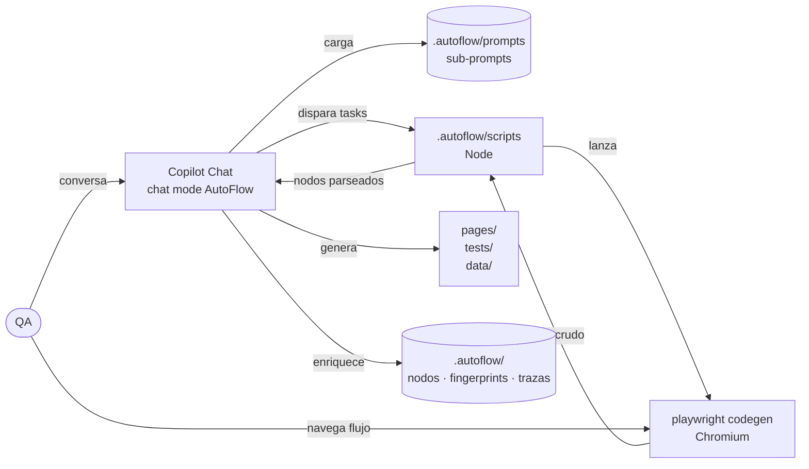
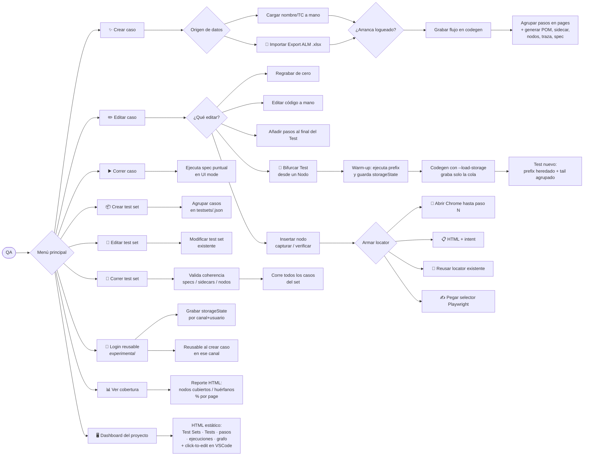
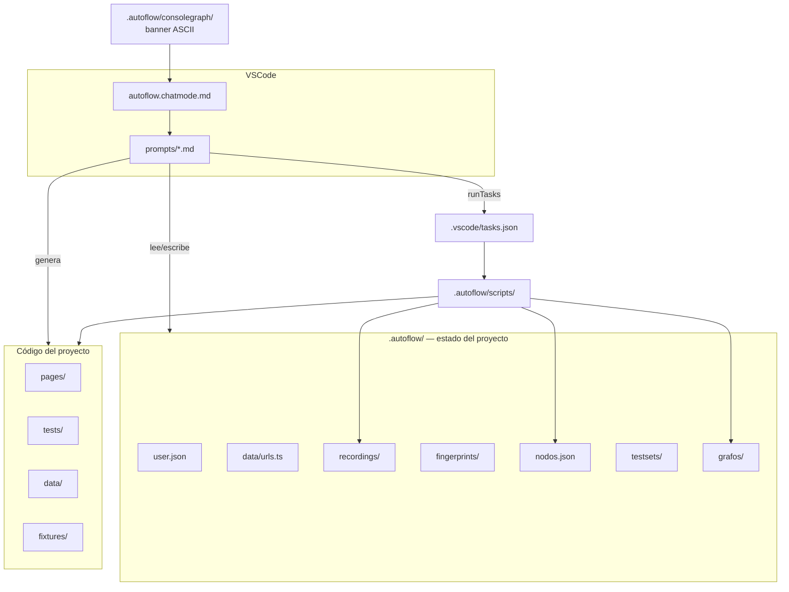
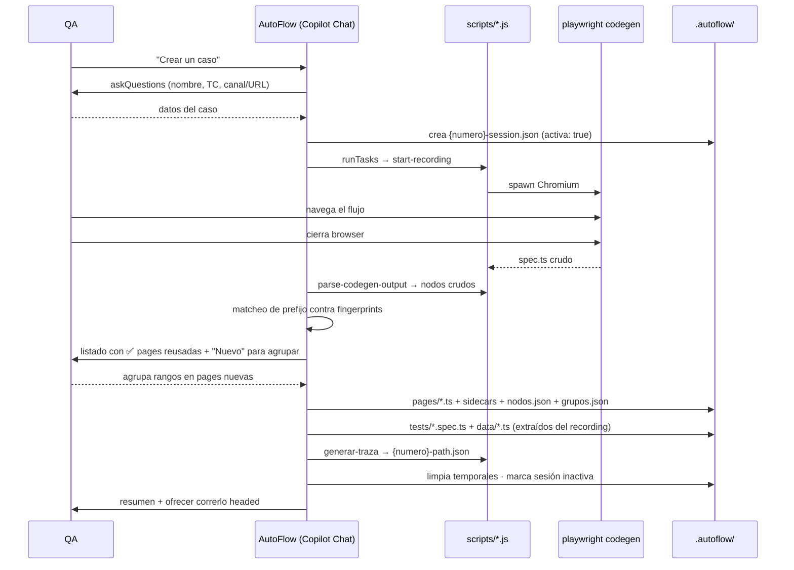

# AutoFlow

Compañero de automatización para QAs. Combina un **chat mode de GitHub Copilot Chat** con scripts de Node que orquestan `playwright codegen` para grabar sesiones manuales y generar **Page Objects + tests en TypeScript** sin que el QA escriba código.


## El problema que resuelve

La automatización moderna tiene cuatro fricciones recurrentes:

1. **Barrera de código.** El QA que entiende el negocio rara vez escribe TypeScript. El que escribe el código rara vez entiende el flujo de negocio. Resultado: tests que cubren lo que el desarrollador cree, no lo que el QA ve.
2. **Page Objects duplicados.** Cada nueva grabación tiende a reinventar pantallas que ya existen. Sin matcheo automático, el repo termina con tres versiones de `LoginPage`.
3. **Locators frágiles sin señal temprana.** Un test que usa `nth-child(3)` pasa hoy y rompe en el próximo refactor del front, pero nada lo marca como deuda hasta que falla en CI.
4. **Sin trazabilidad real.** Los specs ejecutan, pero nadie puede responder "¿qué caminos del usuario están realmente cubiertos?" sin leer cada test a mano.

AutoFlow ataca las cuatro:

- El QA **navega** el flujo en el browser. La grabación se traduce a código siguiendo las convenciones del repo (`.autoflow/conventions/pom-rules.md`). El QA no tipea TypeScript — confirma con botones.
- Cada acción se materializa como un **Nodo** con id determinístico (`{page}::{accion}::{selector}`). Los nodos viven en `.autoflow/nodos.json` y son la base para que el agente **reconozca** flujos repetidos por matcheo de prefijo y **reuse** Page Objects existentes en lugar de duplicarlos.
- Cada nodo lleva una **confiabilidad de 1 a 5** según el tipo de locator (5 = `getByTestId`, 1 = CSS posicional). Visible en el listado al QA y en el grafo de nodos — la deuda de testabilidad se ve antes de que rompa.
- Cada grabación deja una **traza** (`{numero}-path.json`) con la secuencia de ids visitados, incluyendo asserts. Eso permite responder con un diff "qué nodos pasan por dónde" cross-recording, y construir un grafo dirigido del comportamiento real del usuario.

El resultado es un loop cerrado: el QA graba como usuario, el agente le devuelve código que cumple convenciones, y el repo va acumulando estructura analizable en lugar de tests sueltos.

## Qué hace

Es un agente conversacional que vive dentro de VS Code. El QA navega su flujo en el browser; AutoFlow captura la grabación, la parsea, propone un agrupamiento en pantallas reconociendo las que ya existen, y genera los Page Objects, el sidecar de fingerprint, los nodos, la traza y el spec de Playwright.



## Flujos del QA hoy

Esto es lo que el QA puede hacer hoy desde el chat. Cada hoja del árbol es una opción real del menú o de un sub-prompt.



## Cómo funciona por dentro

El cerebro está en tres lugares:

| Pieza | Ubicación | Rol |
| --- | --- | --- |
| **Chat mode** | `.github/chatmodes/autoflow.chatmode.md` | Personalidad, reglas de arranque y routing entre sub-prompts. |
| **Sub-prompts** | `.autoflow/prompts/*.md` | Un archivo por acción. El agente los carga on-demand. |
| **Scripts Node** | `.autoflow/scripts/*.js` | Disparan codegen, parsean su output, generan trazas, regeneran grafos, corren tests. |

El agente solo **conversa, lee/escribe archivos y dispara VSCode tasks**. Toda la lógica imperativa (lanzar codegen, parsear el `.spec.ts` crudo, ejecutar Playwright, calcular trazas) vive en los scripts de Node.



## Flujo típico: crear un caso



Durante la grabación el chat queda **bloqueado** esperando que el QA cierre Chromium. Cuando vuelve, el agente carga `generar-pom.md` y el ciclo continúa.

## Modelo de Nodos

Cada acción del recording (click, fill, goto, assert, hover, etc.) es un **Nodo** con esta forma:

```json
{
  "id": "LoginPage::click::getByRole:button:Ingresar",
  "page": "LoginPage",
  "accion": "click",
  "selector": "getByRole:button:Ingresar",
  "selectorRaw": "getByRole('button', { name: 'Ingresar' })",
  "valor": null,
  "matcher": null,
  "confiabilidad": 4
}
```

Tres usos del modelo:

1. **Reconocimiento de flujos repetidos.** Cuando una grabación nueva arranca con la misma secuencia de ids que un sidecar existente (`.autoflow/fingerprints/{Page}.json`), el agente la marca con ✅ y reusa el Page Object. Solo lo nuevo va a "Nuevo" para agrupar.
2. **Análisis de caminos.** Cada grabación deja una `{numero}-path.json` con la secuencia completa de ids visitados (acciones + asserts). Sirve para responder cross-recording "qué tests pasan por este nodo".
3. **Confiabilidad visible.** Escala 1-5 calculada del tipo de locator: 5 = `getByTestId`, 4 = `getByRole+name`, 3 = `getByLabel`, 2 = `getByPlaceholder`/`getByText`, 1 = CSS crudo. El agente la muestra al QA durante la agrupación y el grafo la pinta.

Dos grafos derivados se regeneran con scripts y viven en `.autoflow/grafos/`:
- [.autoflow/grafos/grafo.md](.autoflow/grafos/grafo.md) — pages y conexiones (`conecta`) entre ellas (alto nivel).
- [.autoflow/grafos/grafo-nodos.md](.autoflow/grafos/grafo-nodos.md) — nodos coloreados por confiabilidad y por tipo (capturar/verificar), con aristas intra-page (`-->`), inter-page (`==>`) y de assert (`-.assert.->`). Pages apiladas verticalmente (TB) con nodos dentro fluyendo en LR para que no se aplaste todo horizontalmente.

Cada grafo se escribe también como `.html` autocontenido (`grafo.html`, `grafo-nodos.html`) con pan/zoom (mermaid + svg-pan-zoom desde CDN). **Abrirlo en el navegador** es lo más cómodo para grafos grandes — la preview de Markdown de VSCode los muestra muy chiquitos.

Detalle completo del shape, escala de confiabilidad y reglas: [.autoflow/conventions/pom-rules.md](.autoflow/conventions/pom-rules.md).

## Datos de prueba

Cada **Test Set** es **autocontenido** en su propio archivo `data/data-{slug}.ts`: declara una `interface Data{PascalSlug}` con todos los campos que necesita (URL inicial, usuarios, montos, búsquedas, productos) y exporta una constante tipada con los valores. **No hay catálogo central de usuarios** — los usuarios viven dentro del data file de su Test Set como propiedades tipadas con la interface `User`.

```typescript
import type { User } from './types';

export interface DataDolarMep {
  urlInicial: string;
  usuarioPrincipal: User;
  importeOperacion: number;
}

export const dataDolarMep: DataDolarMep = {
  urlInicial: 'https://www.banco.com.ar/personas',
  usuarioPrincipal: { canal: 'Home banking', user: 'usuarioPlazoFijo', pass: 'Qa12345!' },
  importeOperacion: 100000,
};
```

Ventaja: cada Test Set es independiente. Un cambio en un set no afecta a los otros y el archivo se lee de punta a punta sin saltar entre archivos. El spec destructura `data{PascalSlug}` al inicio del `test()` y pasa los campos primitivos a los métodos del PO (`usuarioPrincipal.user`, no `usuarioPrincipal` entero).

## Esperas y timeouts

El front del banco es lento, así que los defaults van más holgados que los de Playwright:
- `actionTimeout` arranca en 30s y `navigationTimeout` en 60s ([playwright.config.ts](playwright.config.ts)). Antes ambos eran 60s — bajamos `actionTimeout` para que un selector roto falle en 30s en lugar de colgar el test el doble.
- Los POMs usan `await this.page.waitForLoadState('domcontentloaded')` después de navegar, no sleeps. **Default `'domcontentloaded'`** (no `'networkidle'`): en sites con long-polling, analytics o WebSocket persistentes, `'networkidle'` espera 500ms sin requests y nunca se cumple, dejando el método colgado los 30s del `actionTimeout`. `'networkidle'` solo en SPAs sin telemetría persistente, con comentario justificando.
- `waitForTimeout` está **permitido como último recurso** pero **siempre con un comentario `// Wait: <razón concreta>`**. Sin esa justificación, no se acepta.
- Fixture opcional `humanize` con env var `AUTOFLOW_DELAY_MS` para correr "modo lento" cuando se debugea sin tocar código (ej: `AUTOFLOW_DELAY_MS=500 npm test`).

## Las 6 acciones del menú

| Acción | Sub-prompt | Qué hace |
| --- | --- | --- |
| ✨ Crear un caso | `crear-caso.md` | Pregunta si los datos vienen de un Export ALM (.xlsx) o se cargan a mano, después si arranca logueado (storageState reusable). Pide canal, lanza codegen, captura el flujo, genera POMs y spec. |
| ✏️ Editar un caso | `editar-caso.md` | Regrabar, editar código a mano, **añadir pasos al final** del caso, **insertar nodo de captura/verificación** o **bifurcar el Test desde un Nodo** para crear uno nuevo que reuse el prefix. |
| ▶️ Correr un caso | `correr-caso.md` | Ejecuta un spec puntual con UI mode. |
| 📦 Crear test set | `crear-test-set.md` | Agrupa varios casos en un JSON dentro de `testsets/`. |
| 🔧 Editar test set | `editar-test-set.md` | Modifica un set existente. |
| 🚀 Correr test set | `correr-test-set.md` | Valida coherencia del proyecto (`validar-coherencia.js`) y después corre toda la regresión del set. |
| 🔐 Configurar login reusable | `setup-auth.md` | Graba un storageState por (canal, usuario) para que los siguientes casos arranquen logueados sin re-grabar el login. |
| 📊 Ver cobertura de nodos | (corre `cobertura.js`) | Agrega todas las trazas y emite un reporte HTML con qué nodos están cubiertos, por qué tests, y qué pages tienen 0 cobertura. |
| 🪄 Auto-Health Node | `auto-health-node.md` | Lista los Nodos con confiabilidad ≤3 ordenados por fragilidad + cantidad de Tests que los usan. Para el elegido, navega el flujo hasta el paso anterior, captura el DOM (elemento + 7 ancestros) y propone un locator más confiable razonando sobre el HTML. Solo aplica si la confiabilidad mejora. |
| 📤 Exportar a ALM | `exportar-alm.md` | Exporta un Test a un archivo importable por ALM (xlsx por defecto, csv o json). Un row por cada `test.step` con Test ID, Test Name, Step Number, Step Name, Description (técnica) y Expected Result (de los asserts del step). Granularidad un Test por archivo. |
| 🔧 Utilidades | `utilidades.md` | Aplica/desaplica librerías complementarias que el QA deja en `utils/` (ej: `pdfReporter.ts` para reportes custom). Cada archivo se autodescribe con un header (`@autoflow-util`, `@descripcion`, `@aplicarEn`, `@como-aplicar`). El agente parsea, muestra preview de los cambios y aplica con confirmación por utilidad. Idempotente. Frena si las instrucciones son ambiguas. |
| 🖥️ Abrir dashboard del proyecto | (corre `dashboard.js`) | HTML único navegable con Test Sets, Tests, pasos del flujo, historial de ejecuciones y grafo del paso a paso. Cada nodo se puede abrir en VSCode con un click o copiar como prompt para que el agente lo repare. |

Sub-prompts adicionales que el agente carga sin que el QA los pida:
- `setup-entorno.md` — al activar el modo, verifica `node_modules` y browsers de Playwright.
- `onboarding.md` — primer uso, pide identidad del QA y la guarda en `.autoflow/user.json`.
- `menu-principal.md` — menú de las 6 acciones.
- `generar-pom.md` — post-grabación, agrupa nodos en pages y genera código.
- `insertar-nodo-especial.md` — invocado desde "Editar caso" → "Insertar nodo de captura/verificación".

## Login reusable (storageState)

El front del banco tiene login con OTP, y volver a hacerlo cada vez que se graba un caso es un dolor. AutoFlow lo resuelve grabando el login **una sola vez** por (canal, usuario) y reusando el `storageState` (cookies + localStorage) en los siguientes casos.

1. Desde el menú: **🔐 Configurar login reusable** → `setup-auth.md`.
2. Elegís canal y usuario (escaneados de los `data/data-*.ts` que los referencian, o cargados a mano), y lanzás codegen. Te logueás una vez (incluyendo OTP si aplica) y cerrás el browser.
3. El estado queda en `.autoflow/auth/{canal-slug}-{userKey}.json` (gitignored, sensible).
4. Cuando creás un caso nuevo en ese canal, AutoFlow detecta los logins disponibles y te pregunta si arranca logueado. Si decís sí, codegen arranca con `--load-storage`, el spec generado lleva `test.use({ storageState: ... })` y omite el bloque de login.

Eso reduce la grabación de un caso de "12 pasos (login + OTP + flujo)" a "2 pasos (solo flujo)" cuando ya tenés el auth.

## Validación de coherencia y cobertura

Dos checks automáticos para detectar deuda y guiar la prioridad:

- **Pre-corrida** (`validar-coherencia.js`): se invoca antes de **🚀 Correr Test set**. Detecta specs faltantes, sidecars con ids inexistentes en `nodos.json`, POs sin sidecar, y deprecated sin reemplazo. Si hay errores, te frena antes de gastar tiempo corriendo.
- **Cobertura** (`cobertura.js`): agrega todas las trazas (`recordings/*-path.json`) y te dice qué nodos pisa cada test, qué nodos no pisa nadie, y % de cobertura por page. La salida es un HTML interactivo en `.autoflow/grafos/cobertura.html` con un grafo de pages coloreado de rojo (0% cubierto) a verde (100%).

Es la diferencia entre "tenemos N tests" y "qué del producto está testeado de verdad".

## Importar casos desde ALM

Si el QA ya tiene el caso cargado en ALM, puede arrancar "Crear caso" con la opción **📄 Importar desde Export ALM (.xlsx)** en lugar de tipear nombre/TC a mano. El flujo es:

1. Exportar el caso desde ALM y dejar el `.xlsx` en `.autoflow/alm-exports/`.
2. En el chat, elegir la opción de import y escribir el nombre del archivo (o ruta completa).
3. El script [.autoflow/scripts/parse-alm-export.js](.autoflow/scripts/parse-alm-export.js) lee A2 (test ID), C2 (nombre, lo limpia), G2 (enfoque de prueba) e ignora los pasos de E/F.
4. El agente confirma con el QA y, si hace falta, le permite editar nombre/TC. Después solo se pregunta el canal y arranca codegen.
5. El `enfoque` queda guardado en `{numero}-session.json` bajo `almContext.enfoque` para análisis posterior.

## Nodos especiales: capturar y verificar

A veces un caso necesita validar que un valor del front cambió de una manera específica (ej: "el saldo disminuyó después de transferir"). Para eso AutoFlow tiene dos nodos especiales que se insertan **después** de grabar, desde "Editar caso" → "Insertar nodo de captura/verificación":

- **`capturar`** — lee un valor del DOM en un punto del flujo y lo guarda en una variable per-test bajo el nombre que elija el QA.
- **`verificar`** — vuelve a leer (mismo selector u otro) y compara contra una variable previamente capturada **o** contra un valor literal, según una condición (`igual`, `distinto`, `aumentó`, `disminuyó`, `aumentó al menos N`, `aumentó al menos N%`, `disminuyó al menos N`, `disminuyó al menos N%`).

Las variables viven en el fixture `vars` de [fixtures/index.ts](fixtures/index.ts) y son **per-test** — cada test arranca con un `vars` vacío, sin filtración entre tests. Los parsers de valores (`text`, `number`, `currency-arg`, `date`) están en [data/parsers.ts](data/parsers.ts).

### Cómo se arma el locator

Cuando el QA inserta un nodo especial, el agente le ofrece **4 caminos** para armar el locator:

1. **🔧 Abrir Chrome hasta el paso N** — el agente genera un spec temporal que ejecuta los pasos del caso hasta el punto elegido y termina con `await page.pause()`. Se abre Chrome real con el Playwright Inspector; el QA usa el botón "Pick locator" o copia el outerHTML del contenedor con DevTools.
2. **📋 HTML + intent** — el QA pega un bloque HTML (ej: el contenedor con varias cards de cuentas) y describe qué quiere extraer (ej: *"el saldo en pesos de la cuenta CA"*). El agente razona sobre HTML + descripción + locators existentes en el PO destino y propone un locator robusto, encadenando `.filter({ hasText: ... })` cuando hace falta. Todo el contexto queda guardado en [.autoflow/captures/](.autoflow/captures/) — el HTML, el intent, el locator final y el razonamiento — para que `actualizar-nodos.md` pueda repararlo si el front cambia.
3. **🔁 Reusar locator de un nodo existente** del recording.
4. **✍️ Pegar un selector Playwright** que el QA ya tiene.

## Cómo conversa el agente

Apenas se activa el modo, lo primero que ve el QA es el banner ASCII de [.autoflow/consolegraph/autoFlowAgent-0.1.1.txt](.autoflow/consolegraph/autoFlowAgent-0.1.1.txt) seguido de un aviso corto de que se está chequeando el entorno (Playwright, browsers). Recién después viene el saludo o el onboarding. Para cambiar el banner basta con editar el `.txt` — no hace falta tocar código.

AutoFlow usa la herramienta nativa **`vscode/askQuestions`** de Copilot Chat. En vez de tipear, el QA recibe paneles interactivos:

- **Botones radio** — elegir una opción.
- **Checkboxes** — tildar varias.
- **Campos de texto** — datos libres.
- **Carrusel** — varias preguntas relacionadas en una sola llamada.

> Si el tool no está disponible (Copilot viejo o setting deshabilitado), el agente cae automáticamente a **modo texto** con opciones numeradas. La lógica de routing es idéntica.

## Requisitos

- **VS Code 1.109+** con la extensión **GitHub Copilot Chat** actualizada.
- Setting `chat.askQuestions.enabled` habilitado (suele venir por defecto).
- Plan **Copilot Business** o **Enterprise**.
- **Node 18+**.

## Arranque rápido

```bash
git clone <url-del-repo> autoflow
cd autoflow
code .
```

En VS Code:

1. Abrí Copilot Chat.
2. Elegí el chat mode **AutoFlow** (dropdown arriba del input).
3. Decile *"hola"*.

La **primera vez** detecta que faltan `node_modules` y los browsers de Playwright, y te guía para instalarlos (`npm install` + `npx playwright install chromium`). Después hace un onboarding corto (nombre, legajo, equipo, tribu) y guarda `.autoflow/user.json` (no se commitea). A partir de ahí cada sesión arranca directo en el menú.

> Si preferís instalar a mano: `npm install && npx playwright install chromium` antes de abrir el chat.

## Estructura del repo

| Carpeta / archivo | Para qué |
| --- | --- |
| `.github/chatmodes/autoflow.chatmode.md` | Definición del chat mode (personalidad, routing, reglas de arranque). |
| `.github/copilot-instructions.md` | Convenciones globales del repo. |
| `.autoflow/prompts/` | Sub-prompts que el agente carga según la acción. |
| `.autoflow/conventions/pom-rules.md` | Reglas que el agente sigue al generar POMs y tests. |
| `.autoflow/recordings/` | Estado runtime por grabación (`session`, `parsed`, `grupos`, `path`, `spec`). |
| `.autoflow/fingerprints/` | Sidecar por page con `nodos[]`, `asserts[]` y `conecta[]`. |
| `.autoflow/testsets/` | Definición de cada test set como JSON. |
| `.autoflow/alm-exports/` | xlsx exportados desde ALM. El QA suelta el archivo acá para arrancar un caso con datos prellenados. |
| `.autoflow/auth/` | StorageState (cookies + localStorage) por (canal, usuario) para que los casos arranquen logueados. **Gitignored** — contiene tokens de sesión. |
| `.autoflow/captures/` | Por cada nodo `capturar`/`verificar`: HTML pegado, intent del QA, locator propuesto/final y razonamiento. Histórico para reparar locators cuando el front cambia. |
| `data/urls.ts` | Catálogo de canales (nombre + URL inicial) reusables al crear casos. Lo lee/edita el agente. |
| `.autoflow/scripts/` | Scripts Node: parser de codegen, parser de ALM, generador de traza, grafos (md + html), runners. |
| `.autoflow/nodos.json` | Diccionario global de nodos — fuente de verdad de cada acción. |
| `.autoflow/grafos/` | Diagramas Mermaid (`grafo.md`, `grafo-nodos.md`) y vistas interactivas con pan/zoom (`grafo.html`, `grafo-nodos.html`) para abrir en navegador. |
| `.autoflow/user.json` | Identidad del QA (no se commitea). |
| `.vscode/tasks.json` | Tasks que dispara el agente (`autoflow:start-recording`, `autoflow:run-test*`, `autoflow:run-testset*`). |
| `.autoflow/consolegraph/` | Banner ASCII de arranque que el agente muestra como primer mensaje. |
| `pages/` | Page Objects (los puebla el agente). |
| `tests/` | Specs Playwright (los puebla el agente). |
| `fixtures/index.ts` | Fixtures tipadas (`test.extend`). Sin clase base. Incluye fixture `humanize`. |
| `data/types.ts` | Seeds: interfaces `User` y `Canal` (compartidas por todos los Test Sets). |
| `data/data-{slug}.ts` | Datos autocontenidos del Test Set (interface + usuarios + valores). Lo crea el agente. |
| `data/urls.ts` | Catálogo de canales (nombre + URL inicial) reusables al crear casos. Lo lee/edita el agente. |
| `data/parsers.ts` | Parsers reusables (`parseText`, `parseNumber`, `parseCurrencyAR`, `parseDate`) para nodos `capturar`/`verificar`. |
| `utils/` | Librerías complementarias del QA (reporting custom, hooks de notificación, helpers extra). Cada archivo se autodescribe con un header (`@autoflow-util`, `@descripcion`, `@aplicarEn`, `@como-aplicar`) que el agente lee desde la opción `🔧 Utilidades` del menú para aplicarla al código del proyecto. Convención completa en [utils/README.md](utils/README.md). |
| `playwright.config.ts` | Timeouts amplios para fronts lentos (`actionTimeout` 30s, `navigationTimeout` 60s). Excluye `tests/_temp/` del runner. |
| `clearSession.js` | Resetea el proyecto borrando todo lo generado por el agente. |
| `docs/presentacion.html` | Presentación HTML autocontenida (32 slides) para mostrar AutoFlow al equipo en una reunión de ~1h. Navegación con flechas / barra espaciadora. |

Más detalle del estado runtime y los archivos de cada grabación: [.autoflow/README.md](.autoflow/README.md).

## Comandos manuales

Por si querés correr cosas sin pasar por el agente:

```bash
# Grabar (requiere una sesión activa creada por el agente)
node .autoflow/scripts/start-recording.js
# o:                                npm run record

# Parsear el output de codegen (genera nodos crudos)
node .autoflow/scripts/parse-codegen-output.js <numero>

# Parsear un xlsx exportado de ALM (usado por crear-caso al importar)
node .autoflow/scripts/parse-alm-export.js <archivo-en-alm-exports-o-ruta-completa>

# Exportar un Test a un archivo importable por ALM (xlsx | csv | json)
node .autoflow/scripts/exportar-alm.js <slug-test-set> --test=<testId>
node .autoflow/scripts/exportar-alm.js <slug-test-set> --test=<testId> --format=csv

# Grabar un login reusable (storageState)
node .autoflow/scripts/record-auth.js <canal-slug> <userKey> <urlInicial>

# Generar la traza de un recording (path.json)
node .autoflow/scripts/generar-traza.js <numero>

# Validar coherencia (testsets/specs/sidecars/nodos)
node .autoflow/scripts/validar-coherencia.js          # todo
node .autoflow/scripts/validar-coherencia.js <slug>   # solo un test set

# Reporte de cobertura (.autoflow/grafos/cobertura.{md,html})
node .autoflow/scripts/cobertura.js

# Dashboard del proyecto (.autoflow/dashboard.html)
node .autoflow/scripts/dashboard.js          # solo genera
node .autoflow/scripts/dashboard.js --open   # genera y abre en el browser
npm run dashboard                            # alias del anterior

# Regenerar los grafos (escriben .md + .html en .autoflow/grafos/)
node .autoflow/scripts/grafo.js
node .autoflow/scripts/grafo-nodos.js

# Correr todos los tests
npx playwright test                          # o: npm test
npx playwright test --headed                 # o: npm run test:headed

# Correr un test puntual (default: --reporter=line, sin trace, rápido)
node .autoflow/scripts/run-test.js tests/dolarMep-12345.spec.ts
node .autoflow/scripts/run-test.js tests/dolarMep-12345.spec.ts --headed
node .autoflow/scripts/run-test.js tests/dolarMep-12345.spec.ts --debug    # +reporter=html, +trace=on (modo investigación)

# Correr un test set (idem: default rápido, --debug para investigar)
node .autoflow/scripts/run-testset.js dolarMep                # headless, paralelo
node .autoflow/scripts/run-testset.js dolarMep --headed       # headed, --workers=1
node .autoflow/scripts/run-testset.js dolarMep --debug        # +reporter=html, +trace=on
```

## Resetear el proyecto

Para volver el repo al estado anterior a cualquier sesión (útil para probar el agente desde cero o para limpiar antes de un demo):

```bash
node clearSession.js          # pide confirmación (escribir SI)
node clearSession.js --yes    # sin prompt, para CI o scripts
```

Borra: `user.json`, todas las grabaciones, fingerprints, testsets, `nodos.json`, los dos grafos, `pages/*`, `tests/*`, `data/*` (deja `data/index.ts` reseteado a `export {};`). **No toca** scripts, prompts, conventions, fixtures, configs ni `.gitkeep`.

## Stack

- `@playwright/test` con fixtures vía `test.extend` — **sin clase base**.
- `typescript` estricto.
- Nada más. Sin frameworks, sin servidores, sin webapps.

Convenciones de código completas: [.autoflow/conventions/pom-rules.md](.autoflow/conventions/pom-rules.md).
