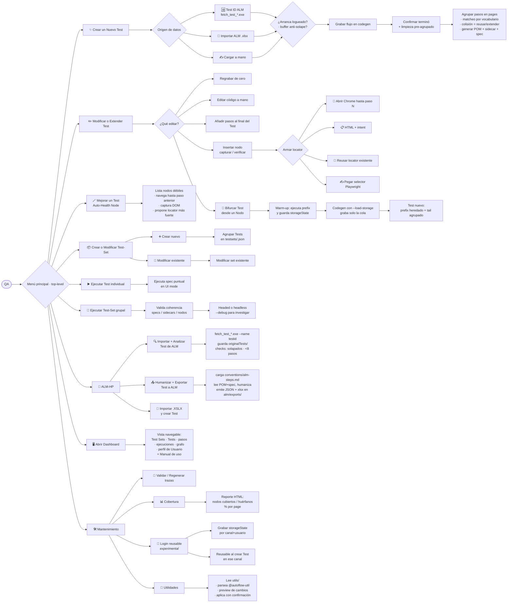
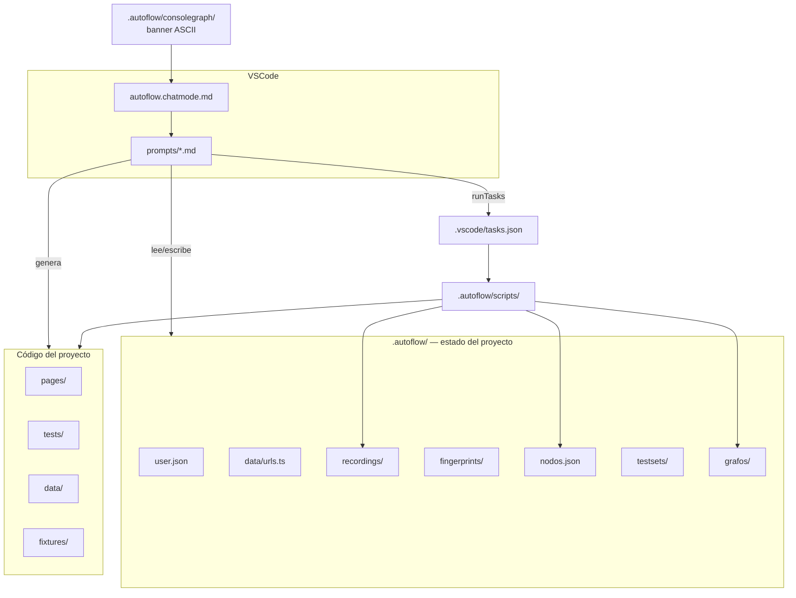

# AutoFlow

Compañero de automatización para QAs. Combina un **chat mode de GitHub Copilot Chat** con scripts de Node que orquestan `playwright codegen` para grabar sesiones manuales y generar **Page Objects + tests en TypeScript** sin que el QA escriba código.


## El problema que resuelve

La automatización moderna tiene cuatro fricciones recurrentes:

1. **Barrera de código.** El QA que entiende el negocio rara vez escribe TypeScript. El que escribe el código rara vez entiende el flujo de negocio. Resultado: tests que cubren lo que el desarrollador cree, no lo que el QA ve.
2. **Page Objects duplicados.** Cada nueva grabación tiende a reinventar pantallas que ya existen. Sin matcheo automático, el repo termina con tres versiones de `LoginPage`.
3. **Locators frágiles sin señal temprana.** Un test que usa `nth-child(3)` pasa hoy y rompe en el próximo refactor del front, pero nada lo marca como deuda hasta que falla en CI.
4. **Sin trazabilidad real.** Los specs ejecutan, pero nadie puede responder "¿qué caminos del usuario están realmente cubiertos?" sin leer cada test a mano.

AutoFlow ataca las cuatro:

- El QA **navega** el flujo en el browser. La grabación se traduce a código siguiendo las convenciones del repo (`.autoflow/conventions/pom-rules.md`). El QA no tipea TypeScript — confirma con botones.
- Cada acción se materializa como un **Nodo** con id determinístico (`{page}::{accion}::{selector}`). Los nodos viven en `.autoflow/nodos.json` y son la base para que el agente **reconozca** flujos repetidos por **matcheo por vocabulario** (cada sidecar es un set de ids posibles en esa page) y **reuse** Page Objects existentes en lugar de duplicarlos.
- Cada nodo lleva una **confiabilidad de 1 a 5** según el tipo de locator (5 = `getByTestId`, 1 = CSS posicional). Visible en el listado al QA y en el grafo de nodos — la deuda de testabilidad se ve antes de que rompa.
- Cada grabación deja una **traza** (`{numero}-path.json`) con la secuencia de ids visitados, incluyendo asserts. Eso permite responder con un diff "qué nodos pasan por dónde" cross-recording, y construir un grafo dirigido del comportamiento real del usuario.

El resultado es un loop cerrado: el QA graba como usuario, el agente le devuelve código que cumple convenciones, y el repo va acumulando estructura analizable en lugar de tests sueltos.

## Qué hace

Es un agente conversacional que vive dentro de VS Code. El QA navega su flujo en el browser; AutoFlow captura la grabación, la parsea, propone un agrupamiento en pantallas reconociendo las que ya existen, y genera los Page Objects, el sidecar de fingerprint, los nodos, la traza y el spec de Playwright.


## Flujos del QA hoy

El menú es **plano de 9 opciones top-level**. Solo `📄 ALM-HP` y `🛠️ Mantenimiento` abren un sub-menú; el resto va directo al sub-prompt. `📦 Crear o Modificar un Test-Set` hace una pregunta inline (crear vs modificar) antes de routear. Esto es lo que el QA puede hacer hoy desde el chat:



## Cómo funciona por dentro

El cerebro está en tres lugares:

| Pieza | Ubicación | Rol |
| --- | --- | --- |
| **Chat mode** | `.github/chatmodes/autoflow.chatmode.md` | Personalidad, reglas de arranque y routing entre sub-prompts. |
| **Sub-prompts** | `.autoflow/prompts/*.md` | Un archivo por acción. El agente los carga on-demand. |
| **Scripts Node** | `.autoflow/scripts/*.js` | Disparan codegen, parsean su output, generan trazas, regeneran grafos, corren tests. |

El agente solo **conversa, lee/escribe archivos y dispara VSCode tasks**. Toda la lógica imperativa (lanzar codegen, parsear el `.spec.ts` crudo, ejecutar Playwright, calcular trazas) vive en los scripts de Node.



## Flujo típico: crear un caso


Durante la grabación el chat queda **bloqueado** esperando que el QA cierre Chromium. Cuando vuelve, el agente carga `generar-pom.md` y el ciclo continúa.

## Modelo de Nodos

Cada acción del recording (click, fill, goto, assert, hover, etc.) es un **Nodo** con esta forma:

```json
{
  "id": "LoginPage::click::getByRole:button:Ingresar",
  "page": "LoginPage",
  "accion": "click",
  "selector": "getByRole:button:Ingresar",
  "selectorRaw": "getByRole('button', { name: 'Ingresar' })",
  "valor": null,
  "matcher": null,
  "confiabilidad": 4
}
```

Tres usos del modelo:

1. **Reconocimiento de flujos repetidos.** Cuando una grabación nueva tiene nodos cuyos ids ya están en algún sidecar (`.autoflow/fingerprints/{Page}.json`), el agente los matchea por **vocabulario** — el sidecar es un set de ids posibles, no una secuencia. Esto permite que dos flujos parecidos (compra Samsung vs Sony) reusen las mismas pages aunque diverjan en algún paso del medio. Componentes globales (navbar, header, footer) se marcan con `tipo: 'componente'` y son candidatos a matchear desde cualquier punto del flujo.
2. **Análisis de caminos.** Cada grabación deja una `{numero}-path.json` con la secuencia completa de ids visitados (acciones + asserts). Sirve para responder cross-recording "qué tests pasan por este nodo".
3. **Confiabilidad visible.** Escala 1-5 calculada del tipo de locator: 5 = `getByTestId`, 4 = `getByRole+name`, 3 = `getByLabel`, 2 = `getByPlaceholder`/`getByText`/`locator('#id')` simple, 1 = otros locator (clases, CSS posicional, XPath). `#id` queda en 2 (no en 1) porque en la práctica los devs cambian texto/i18n más seguido que ids — castigarlo como CSS crudo hace que Auto-Health Node sobre-dispare. El agente la muestra al QA durante la agrupación y el grafo la pinta.

Dos grafos derivados se regeneran con scripts y viven en `.autoflow/grafos/`:
- [.autoflow/grafos/grafo.md](.autoflow/grafos/grafo.md) — pages y conexiones (`conecta`) entre ellas (alto nivel).
- [.autoflow/grafos/grafo-nodos.md](.autoflow/grafos/grafo-nodos.md) — nodos coloreados por confiabilidad y por tipo (capturar/verificar), con aristas intra-page (`-->`), inter-page (`==>`) y de assert (`-.assert.->`). Pages apiladas verticalmente (TB) con nodos dentro fluyendo en LR para que no se aplaste todo horizontalmente.

Cada grafo se escribe también como `.html` autocontenido (`grafo.html`, `grafo-nodos.html`) con pan/zoom (mermaid + svg-pan-zoom desde CDN). **Abrirlo en el navegador** es lo más cómodo para grafos grandes — la preview de Markdown de VSCode los muestra muy chiquitos.

Detalle completo del shape, escala de confiabilidad y reglas: [.autoflow/conventions/pom-rules.md](.autoflow/conventions/pom-rules.md).

## Datos de prueba

Cada **Test Set** es **autocontenido** en su propio archivo `data/data-{slug}.ts`: declara una `interface Data{PascalSlug}` con todos los campos que necesita (URL inicial, usuarios, montos, búsquedas, productos) y exporta una constante tipada con los valores. **No hay catálogo central de usuarios** — los usuarios viven dentro del data file de su Test Set como propiedades tipadas con la interface `User`.

```typescript
import type { User } from './types';

export interface DataDolarMep {
  urlInicial: string;
  usuarioPrincipal: User;
  importeOperacion: number;
}

export const dataDolarMep: DataDolarMep = {
  urlInicial: 'https://www.banco.com.ar/personas',
  usuarioPrincipal: { canal: 'Home banking', user: 'usuarioPlazoFijo', pass: 'Qa12345!' },
  importeOperacion: 100000,
};
```

Ventaja: cada Test Set es independiente. Un cambio en un set no afecta a los otros y el archivo se lee de punta a punta sin saltar entre archivos. El spec destructura `data{PascalSlug}` al inicio del `test()` y pasa los campos primitivos a los métodos del PO (`usuarioPrincipal.user`, no `usuarioPrincipal` entero).

## Esperas y timeouts

El front del banco es lento, así que los defaults van más holgados que los de Playwright:
- `actionTimeout` arranca en 30s y `navigationTimeout` en 60s ([playwright.config.ts](playwright.config.ts)). Antes ambos eran 60s — bajamos `actionTimeout` para que un selector roto falle en 30s en lugar de colgar el test el doble.
- Los POMs usan `await this.page.waitForLoadState('domcontentloaded')` después de navegar, no sleeps. **Default `'domcontentloaded'`** (no `'networkidle'`): en sites con long-polling, analytics o WebSocket persistentes, `'networkidle'` espera 500ms sin requests y nunca se cumple, dejando el método colgado los 30s del `actionTimeout`. `'networkidle'` solo en SPAs sin telemetría persistente, con comentario justificando.
- `waitForTimeout` está **permitido como último recurso** pero **siempre con un comentario `// Wait: <razón concreta>`**. Sin esa justificación, no se acepta.
- Fixture opcional `humanize` con env var `AUTOFLOW_DELAY_MS` para correr "modo lento" cuando se debugea sin tocar código (ej: `AUTOFLOW_DELAY_MS=500 npm test`).

## Las acciones del menú

El menú es **plano de 9 opciones top-level**. Solo `📄 ALM-HP` y `🛠️ Mantenimiento` abren un sub-menú; el resto va directo al sub-prompt. `📦 Crear o Modificar un Test-Set` hace una pregunta inline (crear vs modificar) antes de routear.

| Top-level | ¿Abre sub-menú? | Contenido |
| --- | --- | --- |
| `✨ Crear un Nuevo Test Automatizado` | no | → `crear-caso.md` |
| `✏️ Modificar o Extender un Test existente` | no | → `editar-caso.md` |
| `🪄 Mejorar un Test (Auto-Health Node)` | no | → `auto-health-node.md` |
| `📦 Crear o Modificar un Test-Set` | sub-flujo inline | `➕ Crear nuevo` (`crear-test-set.md`) · `🔧 Modificar existente` (`editar-test-set.md`) |
| `▶️ Ejecutar un Test (Individual)` | no | → `correr-caso.md` |
| `🎯 Ejecutar un Test-Set (Grupal)` | no | → `correr-test-set.md` |
| `📄 Application Lifecycle Management (ALM-HP)` | sí | 🔍 Importar + Analizar Test de ALM · 📤 Humanizar + Exportar Test a ALM · 📄 Importar .XSLX + crear Test |
| `🖥️ Abrir Dashboard del proyecto actual` | no — acción directa | corre `dashboard.js --open` |
| `🛠️ Mantenimiento` | sí | Validar/Regenerar trazas · Cobertura · Login reusable · Utilidades |

Detalle de cada acción:

| Acción | Sub-prompt | Qué hace |
| --- | --- | --- |
| ✨ Crear un Test | `crear-caso.md` | Pregunta si los datos vienen de un Export ALM (.xlsx) o se cargan a mano, después si arranca logueado (storageState reusable) y si aplicar **buffer anti-solape** de 500ms entre acciones (inputs y clicks — cubre validaciones on-input y checkboxes/toggles que no se seleccionan bien con clicks rápidos consecutivos). Pide canal, lanza codegen, **confirma que terminó de grabar** antes de procesar, ofrece **limpieza pre-agrupado** (borrar pasos no deseados), agrupa con **matcheo por vocabulario** contra Pages existentes (sidecar como set de ids, no como secuencia — habilita reuso entre flujos parecidos), **fusiona nodos por valor variable** detectado en el data file (ej: `getByRole({ name: 'Samsung' })` → `{ name: '*' }` parametrizado, así dos Tests con productos distintos reusan la misma Page), genera POMs + sidecar + nodos.json + traza + spec, y al cierre ofrece **smoke test post-generación** que corre el spec headless y, si falla, ofrece reparar el nodo afectado con Auto-Health Node sin volver al menú. |
| ✏️ Editar un Test | `editar-caso.md` | Regrabar, editar código a mano, **añadir pasos al final** del Test, **insertar nodo de captura/verificación**, **acción filtrada en lista** (click + submenú o validar existencia), **elegir fecha en date picker** (parametrizada, soporta input nativo / calendario custom / typeable), o **bifurcar el Test desde un Nodo** para crear uno nuevo que reuse el prefix. |
| ▶️ Correr un Test | `correr-caso.md` | Ejecuta un spec puntual con `--grep=\[testId:N\]` (forma `=` sin quotes — evita el bug de PowerShell escapando mal los corchetes). Default `--reporter=line` (rápido). Tras un fallo ofrece re-correr con `--debug` para reporte HTML + trace. |
| 📦 Crear Test Set | `crear-test-set.md` | Agrupa varios Tests en un JSON dentro de `testsets/`. Crea siempre el archivo spec con el `test.describe` listo. |
| 🔧 Editar Test Set | `editar-test-set.md` | Modifica un set existente: agregar/quitar Tests (mueve los `test()` entre specs), renombrar, cambiar descripción, eliminar. |
| 🚀 Correr Test Set | `correr-test-set.md` | Valida coherencia (`validar-coherencia.js`) y pregunta **headed (visual, secuencial) o headless (paralelo, rápido)**. Si falla, ofrece re-correr con `--debug` o reparar nodos sospechosos. |
| 🔐 Login reusable (experimental) | `setup-auth.md` | Graba un storageState por (canal, usuario) para que los siguientes Tests arranquen logueados sin re-grabar el login. |
| 📊 Cobertura de Nodos | (corre `cobertura.js`) | Agrega todas las trazas y emite un reporte HTML con qué nodos están cubiertos, por qué Tests, y qué pages tienen 0 cobertura. |
| 🪄 Auto-Health Node | `auto-health-node.md` | Lista los Nodos con confiabilidad ≤3 ordenados por fragilidad + cantidad de Tests que los usan. Para el elegido, navega el flujo hasta el paso anterior, captura el DOM (elemento + 7 ancestros, fallback a body completo) y propone un locator más confiable razonando sobre el HTML. Solo aplica si la confiabilidad mejora. |
| 🧬 Validar / Regenerar trazas | `validar-trazas.md` | Audita las trazas de todos los Tests grabados. Reporta cuáles están OK, cuáles regeneró desde inputs disponibles (`parsed.json` + `grupos.json`), cuáles fallan, y cuáles son irrecuperables (sin inputs, hay que regrabar). Soluciona el caso típico de "el dashboard muestra Tests sin pasos" porque la traza nunca se generó. |
| 🔍 Importar y Analizar Test de ALM | `importar-test-alm.md` | Usa la integración binaria `.autoflow/alm/integrations/fetch_test_v1.0.0.exe` (chequeo determinístico vía `node -e fs.existsSync`, no `file_search` que skipea binarios). Pide el testid, corre el .exe con `--name {testid}`, persiste el JSON crudo en `.autoflow/alm/originalTests/{test_id}.json` y aplica 2 checks de calidad: alerta si `step_count < 8` (caso muy reducido) + heurística para detectar pasos solapados (múltiples verbos imperativos o conectores `y/luego/además` en una sola `description`/`expected`). **No graba ni modifica nada del repo** — solo audita. |
| 📤 Humanizar y Exportar Test a ALM | `exportar-alm.md` + `conventions/alm-steps.md` | Carga la convención `alm-steps.md` como fuente de verdad (rol de QA Lead senior, vocabulario, reglas técnico→negocio, granularidad, formato JSON, checklist de calidad). Pide qué Test exportar, lee POM(s) + spec siguiendo cadenas `retornaPage`, humaniza siguiendo las buenas prácticas (acciones imperativas, sin selectores ni jerga de Playwright, un step = una acción observable) y emite `.autoflow/alm/exports/{slug}-testId-{N}-{ts}.json` con shape `{ test_id, new_steps: [{action, name, description, expected}] }`. Dispara `alm-json-to-xlsx.js` para generar el `.xlsx` hermano. **Post-export**: si hay un original cacheado en `alm/originalTests/{testId}.json`, compara cuantitativa (N pasos, delta, %) y cualitativamente (granularidad, cobertura de `expected`, vocabulario, verificaciones) — citando ejemplos concretos de qué mejoró el caso nuevo. A futuro, un `.exe` de la integración va a leer el JSON y subir los steps a ALM directamente. |
| 📄 Importar .XSLX y crear Test | `crear-caso.md` con `origen: "alm-xlsx"` (o `"alm"` legado) | Atajo a la rama xlsx del paso 0.b de `crear-caso.md` saltando la pregunta inicial. Lee A2 (testId), C2 (nombre), G2 (enfoque) del xlsx que dejaste en `.autoflow/alm-exports/`. |
| 🔧 Utilidades | `utilidades.md` | Aplica/desaplica librerías complementarias que el QA deja en `utils/` (ej: `pdfReporter.ts` para reportes custom). Cada archivo se autodescribe con un header (`@autoflow-util`, `@descripcion`, `@aplicarEn`, `@como-aplicar`). El agente parsea, muestra preview de los cambios y aplica con confirmación por utilidad. Idempotente. Frena si las instrucciones son ambiguas. |
| 🖥️ Abrir dashboard del proyecto | (corre `dashboard.js`) | Vista única navegable con Test Sets, Tests, pasos del flujo, historial de ejecuciones, grafo del paso a paso (subgraph por Page con colores), perfil de Usuario editable, **Manual de uso** embebido, y **tab ALM** (cuando hay Tests importados de ALM): lista con diff cuantitativo (N pasos original vs nuevo, delta, %) y vista detalle por testId con análisis cualitativo markdown + pasos lado a lado original-vs-humanizado para revisión visual. Cada nodo se puede abrir en VSCode con un click o copiar como prompt para que el agente lo repare / bifurque / aplique Auto-Health. |

Sub-prompts adicionales que el agente carga sin que el QA los pida:
- `setup-entorno.md` — al activar el modo, verifica `node_modules` y browsers de Playwright + detecta sesiones zombi.
- `onboarding.md` — primer uso, pide identidad del QA y la guarda en `.autoflow/user.json`.
- `menu-principal.md` — menú top-level plano de 9 opciones; ALM-HP y Mantenimiento conservan sub-menú.
- `generar-pom.md` — post-grabación, limpieza pre-agrupado, matcheo por vocabulario contra sidecars conocidos (sidecar como set de ids, no como secuencia de flujo), agrupación interactiva, generación de POMs/sidecar/spec, regrafos al final. Delega en `pom-colision.md` (colisión de nombres) y `pom-append-grabado.md` (modo añadir pasos).
- `pom-colision.md` — sub-flow de `generar-pom.md`. Maneja la colisión cuando el QA elige un nombre de Page Object que ya existe (reusar método, agregar método nuevo, o cambiar nombre).
- `pom-append-grabado.md` — sub-flow de `generar-pom.md`. Mergea pasos recién grabados al final de un Test existente reusando POs ya conocidos. Distinto de `append-manual.md` (este último arranca de HTML pegado, sin grabar).
- `insertar-nodo-especial.md` — invocado desde "Editar Test" → "Insertar nodo de captura/verificación".
- `actualizar-nodos.md` — invocado tras un Test fallido para reparar locators que cambiaron en el front. Ofrece "🪄 Capturar DOM y proponer" o "✍️ Pegar a mano".
- `bifurcar-caso.md` — invocado desde "Editar Test" o desde el modal de Nodo del dashboard. Crea un Test nuevo reusando el prefix de un Test existente.
- `append-manual.md` — invocado desde "Añadir pasos al final" cuando el QA quiere armar pasos sin re-grabar (HTML + intent).
- `auto-health-node.md` — sanea locators débiles capturando el DOM real.

## Login reusable (storageState)

El front del banco tiene login con OTP, y volver a hacerlo cada vez que se graba un caso es un dolor. AutoFlow lo resuelve grabando el login **una sola vez** por (canal, usuario) y reusando el `storageState` (cookies + localStorage) en los siguientes casos.

1. Desde el menú: **🔐 Configurar login reusable** → `setup-auth.md`.
2. Elegís canal y usuario (escaneados de los `data/data-*.ts` que los referencian, o cargados a mano), y lanzás codegen. Te logueás una vez (incluyendo OTP si aplica) y cerrás el browser.
3. El estado queda en `.autoflow/auth/{canal-slug}-{userKey}.json` (gitignored, sensible).
4. Cuando creás un caso nuevo en ese canal, AutoFlow detecta los logins disponibles y te pregunta si arranca logueado. Si decís sí, codegen arranca con `--load-storage`, el spec generado lleva `test.use({ storageState: ... })` y omite el bloque de login.

Eso reduce la grabación de un caso de "12 pasos (login + OTP + flujo)" a "2 pasos (solo flujo)" cuando ya tenés el auth.

## Validación de coherencia y cobertura

Dos checks automáticos para detectar deuda y guiar la prioridad:

- **Pre-corrida** (`validar-coherencia.js`): se invoca antes de **🚀 Correr Test set**. Detecta specs faltantes, sidecars con ids inexistentes en `nodos.json`, POs sin sidecar, y deprecated sin reemplazo. Si hay errores, te frena antes de gastar tiempo corriendo.
- **Cobertura** (`cobertura.js`): agrega todas las trazas (`recordings/*-path.json`) y te dice qué nodos pisa cada test, qué nodos no pisa nadie, y % de cobertura por page. La salida es un HTML interactivo en `.autoflow/grafos/cobertura.html` con un grafo de pages coloreado de rojo (0% cubierto) a verde (100%).

Es la diferencia entre "tenemos N tests" y "qué del producto está testeado de verdad".

## Importar casos desde ALM

Hay **3 caminos** según lo que estés buscando:

### A. Importar + Analizar (no graba nada)
**Menú → 📄 ALM-HP → 🔍 Importar y Analizar Test de ALM**. Usa la integración binaria `fetch_test_v1.0.0.exe` para traer los datos del Test por testid, los guarda en `.autoflow/alm/originalTests/` y aplica chequeos de calidad (pasos solapados, cantidad mínima). Ideal cuando querés inspeccionar antes de decidir si lo automatizás.

### B. Crear Test arrancando desde ALM (con grabación)
Tres sub-caminos desde **🆔 / 📄 / ✍️** en el paso 0 de Crear Test:
- 🆔 Por testid con la integración (`fetch_test_v1.0.0.exe`) — autopopula nombre+steps informativos.
- 📄 Importar XLSX exportado de ALM — script [`parse-alm-export.js`](.autoflow/scripts/parse-alm-export.js) lee A2 (test ID), C2 (nombre), G2 (enfoque). El XLSX se deja en `.autoflow/alm-exports/`. **Atajo directo** desde el sub-menú ALM-HP → 📄 Importar .XSLX y Crear un Nuevo Test Automatizado.
- ✍️ Manual.

El `enfoque` (del XLSX) queda guardado en `{numero}-session.json` bajo `almContext.enfoque`. El `test_id` (de la integración) queda en `almContext.testId`.

### C. Humanizar y Exportar a ALM (inversa)
**Menú → 📄 ALM-HP → 📤 Humanizar y Exportar Test Automatizado a ALM**. Toma un Test ya automatizado, lo humaniza siguiendo `.autoflow/conventions/alm-steps.md` y genera un JSON + xlsx en `.autoflow/alm/exports/`. Si previamente importaste el mismo testId via "🔍 Importar y Analizar Test de ALM", el flujo cierra con una **comparación contra el original**: delta de cantidad de pasos (absoluto y porcentual) + análisis cualitativo (granularidad, cobertura de `expected`, vocabulario consistente, verificaciones agregadas), citando ejemplos concretos. A futuro un `.exe` de la integración va a leer el JSON y subirlo a ALM directamente.

## Nodos especiales: capturar y verificar

A veces un caso necesita validar que un valor del front cambió de una manera específica (ej: "el saldo disminuyó después de transferir"). Para eso AutoFlow tiene dos nodos especiales que se insertan **después** de grabar, desde "Editar caso" → "Insertar nodo de captura/verificación":

- **`capturar`** — lee un valor del DOM en un punto del flujo y lo guarda en una variable per-test bajo el nombre que elija el QA.
- **`verificar`** — vuelve a leer (mismo selector u otro) y compara contra una variable previamente capturada **o** contra un valor literal, según una condición (`igual`, `distinto`, `aumentó`, `disminuyó`, `aumentó al menos N`, `aumentó al menos N%`, `disminuyó al menos N`, `disminuyó al menos N%`).

Las variables viven en el fixture `vars` de [fixtures/index.ts](fixtures/index.ts) y son **per-test** — cada test arranca con un `vars` vacío, sin filtración entre tests. Los parsers de valores (`text`, `number`, `currency-arg`, `date`) están en [data/parsers.ts](data/parsers.ts).

### Cómo se arma el locator

Cuando el QA inserta un nodo especial, el agente le ofrece **4 caminos** para armar el locator:

1. **🔧 Abrir Chrome hasta el paso N** — el agente genera un spec temporal que ejecuta los pasos del caso hasta el punto elegido y termina con `await page.pause()`. Se abre Chrome real con el Playwright Inspector; el QA usa el botón "Pick locator" o copia el outerHTML del contenedor con DevTools.
2. **📋 HTML + intent** — el QA pega un bloque HTML (ej: el contenedor con varias cards de cuentas) y describe qué quiere extraer (ej: *"el saldo en pesos de la cuenta CA"*). El agente razona sobre HTML + descripción + locators existentes en el PO destino y propone un locator robusto, encadenando `.filter({ hasText: ... })` cuando hace falta. Todo el contexto queda guardado en [.autoflow/captures/](.autoflow/captures/) — el HTML, el intent, el locator final y el razonamiento — para que `actualizar-nodos.md` pueda repararlo si el front cambia.
3. **🔁 Reusar locator de un nodo existente** del recording.
4. **✍️ Pegar un selector Playwright** que el QA ya tiene.

## Cómo conversa el agente

Apenas se activa el modo, lo primero que ve el QA es el banner ASCII de [.autoflow/consolegraph/autoFlowAgent-0.1.1.txt](.autoflow/consolegraph/autoFlowAgent-0.1.1.txt) seguido de un aviso corto de que se está chequeando el entorno (Playwright, browsers). Recién después viene el saludo o el onboarding. Para cambiar el banner basta con editar el `.txt` — no hace falta tocar código.

AutoFlow usa la herramienta nativa **`vscode/askQuestions`** de Copilot Chat. En vez de tipear, el QA recibe paneles interactivos:

- **Botones radio** — elegir una opción.
- **Checkboxes** — tildar varias.
- **Campos de texto** — datos libres.
- **Carrusel** — varias preguntas relacionadas en una sola llamada.

> Si el tool no está disponible (Copilot viejo o setting deshabilitado), el agente cae automáticamente a **modo texto** con opciones numeradas. La lógica de routing es idéntica.

## Requisitos

- **VS Code 1.109+** con la extensión **GitHub Copilot Chat** actualizada.
- Setting `chat.askQuestions.enabled` habilitado (suele venir por defecto).
- Plan **Copilot Business** o **Enterprise**.
- **Node 18+**.

## Primeros pasos

Si sos QA y vas a usar AutoFlow por primera vez, el camino más rápido es:

1. Cloná el repo (o abrilo si ya lo tenés) y abrí Copilot Chat con el chat mode **AutoFlow**.
2. Decile *"hola"*. La primera vez te pide tu identidad (`nombre`, `legajo`, `equipo`, `tribu`) y la guarda en `.autoflow/user.json`.
3. Generá el dashboard con `npm run dashboard` (o desde el menú: `🖥️ Abrir dashboard`). Adentro vas a encontrar **📖 Manual de uso** con tutorial paso a paso, conceptos clave, troubleshooting y casos avanzados.

El manual del dashboard está pensado para tener cerca mientras grabás casos. Lo de abajo en este README es referencia técnica (arquitectura, convenciones, comandos manuales) — más para devs/QAs leads que para uso diario.

## Arranque rápido

```bash
git clone <url-del-repo> autoflow
cd autoflow
code .
```

En VS Code:

1. Abrí Copilot Chat.
2. Elegí el chat mode **AutoFlow** (dropdown arriba del input).
3. Decile *"hola"*.

La **primera vez** detecta que faltan `node_modules` y los browsers de Playwright, y te guía para instalarlos (`npm install` + `npx playwright install chromium`). Después hace un onboarding corto (nombre, legajo, equipo, tribu) y guarda `.autoflow/user.json` (no se commitea). A partir de ahí cada sesión arranca directo en el menú.

> Si preferís instalar a mano: `npm install && npx playwright install chromium` antes de abrir el chat.

## Estructura del repo

| Carpeta / archivo | Para qué |
| --- | --- |
| `.github/chatmodes/autoflow.chatmode.md` | Definición del chat mode (personalidad, routing, reglas de arranque). |
| `.github/copilot-instructions.md` | Convenciones globales del repo. |
| `.autoflow/prompts/` | Sub-prompts que el agente carga según la acción. |
| `.autoflow/conventions/pom-rules.md` | Reglas que el agente sigue al generar POMs y tests. |
| `.autoflow/recordings/` | Estado runtime por grabación (`session`, `parsed`, `grupos`, `path`, `spec`). |
| `.autoflow/fingerprints/` | Sidecar por page con `tipo`, `nodos[]`, `asserts[]` y `conecta[]`. `tipo: 'componente'` distingue navbars/headers globales de pages reales. |
| `.autoflow/testsets/` | Definición de cada test set como JSON. |
| `.autoflow/alm-exports/` | xlsx exportados desde ALM. El QA suelta el archivo acá para arrancar un caso con datos prellenados. |
| `.autoflow/alm/integrations/` | Ejecutables propietarios que pegan a ALM por testid. Si está `fetch_test_v1.0.0.exe`, la opción `🆔 Importar caso de ALM con el número de Test ID` (paso 0.a de `crear-caso.md`) lo invoca con `--name {testid}` para traer el `test_name` + steps registrados. **Gitignored** — los binarios se distribuyen aparte. |
| `.autoflow/alm/originalTests/` | Cache local del JSON crudo devuelto por cada fetch de la integración (un archivo por testid). **Gitignored**. |
| `.autoflow/auth/` | StorageState (cookies + localStorage) por (canal, usuario) para que los casos arranquen logueados. **Gitignored** — contiene tokens de sesión. |
| `.autoflow/captures/` | Por cada nodo `capturar`/`verificar`: HTML pegado, intent del QA, locator propuesto/final y razonamiento. Histórico para reparar locators cuando el front cambia. |
| `.autoflow/scripts/` | Scripts Node: parser de codegen, parser/exporter de ALM, generador de traza, grafos (md + html), runners, dashboard, verificación de recordings, Auto-Health Node. |
| `.autoflow/nodos.json` | Diccionario global de nodos — fuente de verdad de cada acción. |
| `.autoflow/grafos/` | Diagramas Mermaid (`grafo.md`, `grafo-nodos.md`) y vistas interactivas con pan/zoom (`grafo.html`, `grafo-nodos.html`) para abrir en navegador. |
| `.autoflow/user.json` | Identidad del QA (no se commitea). |
| `.vscode/tasks.json` | Tasks que dispara el agente (`autoflow:start-recording`, `autoflow:run-test*`, `autoflow:run-testset*`). |
| `.autoflow/consolegraph/` | Banner ASCII de arranque que el agente muestra como primer mensaje. |
| `.autoflow/runs/` | Historial JSON de cada corrida (metadata: status, duración, testIds, `artifactsDir`). Lo lee el dashboard. Suma sub-carpetas `{DD_MM_YYYY}/ResultsALM.json` — daily aggregator con una entry por testId (status, pdfPath, testSet) que escribe el reporter; pensado como input para una futura integración que suba a ALM. **Gitignored**. |
| `runs/` | Carpeta por corrida en la **raíz del repo** con artifacts de Playwright. Cada sub-carpeta tiene formato `DD_MM_YYYY_HH-MM-SS` y la crean los wrappers `run-test.js` / `run-testset.js` antes de invocar Playwright (`AUTOFLOW_RUN_DIR` → `playwright.config.ts` `outputDir`). Si la corrida vino sin wrapper (npx directo, plugin de VSCode), `playwright.config.ts` crea la carpeta él mismo en module-load. **Contenido**: screenshots de fallo + traces + videos + attachments de Playwright; `screens/{testId}/{label}_DD_MM_YYYY_HH_MM_SS.jpg` con las capturas que toma el helper `screen()` en puntos clave del flujo (insertadas auto por `generar-pom.md` en botones de confirmación / pantallas principales, o manualmente vía editar-caso → `📸 Insertar screenshot`); y el **PDF del reporte** `{testId\|slug}.pdf` con datos del run + sección Evidencia, generado por `lib/pdf-report.js` desde el reporter al cierre. **Gitignored**. |
| `pages/` | Page Objects (los puebla el agente). |
| `tests/` | Specs Playwright (los puebla el agente). |
| `fixtures/index.ts` | Fixtures tipadas (`test.extend`). Sin clase base. Incluye fixture `humanize` + helper `bufferEntreAcciones(page)` para el wait anti-solape entre acciones (centraliza el buffer; respeta env `AUTOFLOW_BUFFER_MS`) + helper `screen(page, label)` que captura JPEG quality 60 viewport-only en `{AUTOFLOW_RUN_DIR}/screens/{testId}/{label}_DD_MM_YYYY_HH_MM_SS.jpg`, esperando `domcontentloaded` y `aria-busy=false` antes de disparar. Si `AUTOFLOW_RUN_DIR` no está seteado retorna `null` silencioso (no rompe). Lo inserta el agente automáticamente en `generar-pom.md` (botones de confirmación + pantallas principales) o manualmente vía `editar-caso.md → 📸 Insertar screenshot`. |
| `data/types.ts` | Seeds: interfaces `User` y `Canal` (compartidas por todos los Test Sets). |
| `data/data-{slug}.ts` | Datos autocontenidos del Test Set (interface + usuarios + valores). Lo crea el agente. |
| `data/urls.ts` | Catálogo de canales (nombre + URL inicial) reusables al crear casos. Lo lee/edita el agente. |
| `data/parsers.ts` | Parsers reusables (`parseText`, `parseNumber`, `parseCurrencyAR`, `parseDate`) para nodos `capturar`/`verificar`. |
| `utils/` | Librerías complementarias del QA (reporting custom, hooks de notificación, helpers extra). Cada archivo se autodescribe con un header (`@autoflow-util`, `@descripcion`, `@aplicarEn`, `@como-aplicar`) que el agente lee desde la opción `🔧 Utilidades` del menú para aplicarla al código del proyecto. Convención completa en [utils/README.md](utils/README.md). |
| `playwright.config.ts` | Timeouts amplios para fronts lentos (`actionTimeout` 30s, `navigationTimeout` 60s). Excluye `tests/_temp/` del runner. |
| `.autoflow/clearSession.js` | Resetea el proyecto borrando todo lo generado por el agente. Resuelve cwd a la raíz del repo, así corre igual desde cualquier ubicación. |
| `docs/presentacion.html` | Presentación HTML autocontenida (32 slides) para mostrar AutoFlow al equipo en una reunión de ~1h. Navegación con flechas / barra espaciadora. |

Más detalle del estado runtime y los archivos de cada grabación: [.autoflow/README.md](.autoflow/README.md).

## Comandos manuales

Por si querés correr cosas sin pasar por el agente:

```bash
# Grabar (requiere una sesión activa creada por el agente)
node .autoflow/scripts/start-recording.js
# o:                                npm run record

# Parsear el output de codegen (genera nodos crudos)
node .autoflow/scripts/parse-codegen-output.js <numero>

# Parsear un xlsx exportado de ALM (usado por crear-caso al importar)
node .autoflow/scripts/parse-alm-export.js <archivo-en-alm-exports-o-ruta-completa>

# Convertir un JSON humanizado (alm/exports/) a xlsx hermano. El JSON lo genera
# el agente desde el menú ALM-HP → Humanizar y Exportar; este script solo serializa
# a binario, la redacción la hace el agente siguiendo conventions/alm-steps.md.
node .autoflow/scripts/alm-json-to-xlsx.js <path al .json en .autoflow/alm/exports/>

# Grabar un login reusable (storageState)
node .autoflow/scripts/record-auth.js <canal-slug> <userKey> <urlInicial>

# Generar la traza de un recording (path.json)
node .autoflow/scripts/generar-traza.js <numero>

# Validar coherencia (testsets/specs/sidecars/nodos)
node .autoflow/scripts/validar-coherencia.js          # todo
node .autoflow/scripts/validar-coherencia.js <slug>   # solo un test set
node .autoflow/scripts/validar-coherencia.js --fix    # mueve specPath a la raíz si quedó dentro de casos[]

# Audit del estado del proyecto (coherencia + trazas, sin regenerar)
npm run audit
# o equivalente:
node .autoflow/scripts/validar-coherencia.js && node .autoflow/scripts/validar-trazas.js --solo-audit

# Validar/Regenerar trazas (si hay tests sin path.json y los inputs siguen)
node .autoflow/scripts/validar-trazas.js              # regenera lo que pueda
node .autoflow/scripts/validar-trazas.js --solo-audit # solo reporta, no regenera

# Reporte de cobertura (.autoflow/grafos/cobertura.{md,html})
node .autoflow/scripts/cobertura.js

# Dashboard del proyecto (.autoflow/dashboard.html)
node .autoflow/scripts/dashboard.js          # solo genera
node .autoflow/scripts/dashboard.js --open   # genera y abre en el browser
npm run dashboard                            # alias del anterior

# Regenerar los grafos (escriben .md + .html en .autoflow/grafos/)
node .autoflow/scripts/grafo.js
node .autoflow/scripts/grafo-nodos.js

# Correr todos los tests
npx playwright test                          # o: npm test
npx playwright test --headed                 # o: npm run test:headed

# Correr un test puntual (default: --reporter=line, sin trace, rápido)
node .autoflow/scripts/run-test.js tests/dolarMep-12345.spec.ts
node .autoflow/scripts/run-test.js tests/dolarMep-12345.spec.ts --headed
node .autoflow/scripts/run-test.js tests/dolarMep-12345.spec.ts --debug    # +reporter=html, +trace=on (modo investigación)

# Correr un test set (idem: default rápido, --debug para investigar)
node .autoflow/scripts/run-testset.js dolarMep                # headless, paralelo
node .autoflow/scripts/run-testset.js dolarMep --headed       # headed, --workers=1
node .autoflow/scripts/run-testset.js dolarMep --debug        # +reporter=html, +trace=on
```

## Resetear el proyecto

Para volver el repo al estado anterior a cualquier sesión (útil para probar el agente desde cero o para limpiar antes de un demo):

```bash
node .autoflow/clearSession.js          # pide confirmación (escribir SI)
node .autoflow/clearSession.js --yes    # sin prompt, para CI o scripts
```

Borra: `user.json`, todas las grabaciones, fingerprints, testsets, `nodos.json`, los dos grafos, `pages/*`, `tests/*`, `data/data-*.ts`. Resetea los seeds `data/index.ts` y `data/urls.ts` a su contenido inicial (re-exports + array de canales vacío). **No toca** `data/types.ts`, `data/parsers.ts`, scripts, prompts, conventions, fixtures, configs, `utils/`, `.claude/` ni `.gitkeep`.

## Stack

- `@playwright/test` con fixtures vía `test.extend` — **sin clase base**.
- `typescript` estricto.
- Nada más. Sin frameworks, sin servidores, sin webapps.

Convenciones de código completas: [.autoflow/conventions/pom-rules.md](.autoflow/conventions/pom-rules.md).
